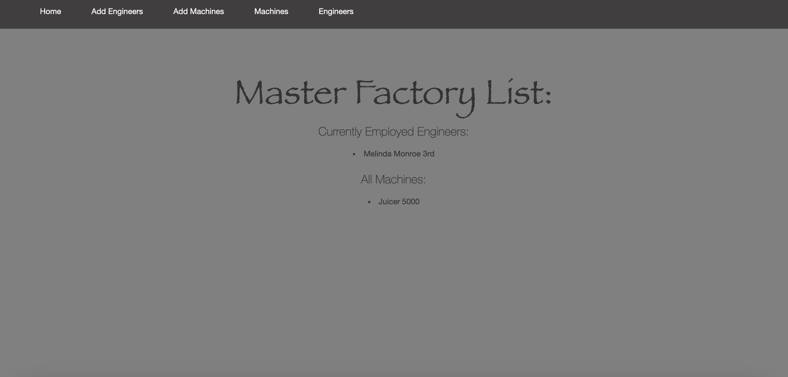

# _SillyStrings Factory_

### _Factory Tracker & 1.8.2021_

### By Svea Wade 

## **Project Description**

This is an application to keep track of a companies machine repairs. It is an MVC web application to manage their engineers, and the machines they are licensed to fix. 

**User Stories**: 
* As the factory manager, I need to be able to see a list of all engineers, and I need to be able to see a list of all machines.
* As the factory manager, I need to be able to select a engineer, see their details, and see a list of all machines that engineer is licensed to repair. I also need to be able to select a machine, see its details, and see a list of all engineers licensed to repair it.
* As the factory manager, I need to add new engineers to our system when they are hired. I also need to add new machines to our system when they are installed.
* As the factory manager, I should be able to add new machines even if no engineers are employed. I should also be able to add new engineers even if no machines are installed
* As the factory manager, I need to be able to add or remove machines that a specific engineer is licensed to repair. I also need to be able to modify this relationship from the other side, and add or remove engineers from a specific machine.
* I should be able to navigate to a splash page that lists all engineers and machines. Users should be able to click on an individual engineer or machine to see all the engineers/machines that belong to it.


## Usage / Examples

Home page shows the current list of engineers and machines. Also has a nav bar for ease of use on each page. 
The Home Page (localhost:5000/vendors)

## **Required for Use**
* C# and .Net Core installed on your local machine. (Developed on .Net Core v2.2.4)
* Console/Terminal access.
* Code Editor like [Visual Studio Code](https://code.visualstudio.com/)
* MySQL Community Server
* MySQL Workbench


## **Installation Instructions**
Download [.Net Core](https://dotnet.microsoft.com/download) and follow the installation instructions for your computer's
operating system.


### **Installing C#, .NET**
Install C# and .Net according to your operating system below:

**For Mac**
1. Download this .NET Core SDK Software Development Kit. 
2. Open the .pkg file. This will launch an installer which will walk you through installation steps. Use the default settings the installer suggests.
3. Confirm the installation is successful by opening your terminal and running the command <code>dotnet --version</code>, which should return the correct version number.

**For Windows**
1. Download either the the 64-bit .NET Core SDK Software Development Kit
2. Open the file and follow the steps provided by the installer for your OS.
3. Confirm the installation is successful by opening a new Windows PowerShell window and running the command <code>dotnet --version</code> You should see a response with the correct version number.

**My SQL Installation Below** 

**Windows 10 -**

Start by downloading the MySQL Web Installer from the [MySQL Downloads](https://dev.mysql.com/downloads/file/?id=484919) page. (Use the No thanks, just start my download link.)

Follow along with the installer:

1) Click "Yes" if prompted to update.
2) Accept license terms.
3) Choose Custom setup type.
4) When prompted to Select Products and Features, choose the following:
* MySQL Server 8.0.19 (This will be under "MySQL Servers > MySQL Server > MySQL Server 8.0")

* MySQL Workbench 8.0.19 (This will be under "Applications > MySQL Workbench > MySQL Workbench 8.0")

5) Select "Next", then "Execute". Wait for download and installation. (This can take a few minutes.)

6) Advance through Configuration as follows:

* High Availability set to "Standalone".

* "Defaults are OK" under Type and Networking.

* Authentication Method set to Use Legacy Authentication Method.

* Set password to something you will remember. 

* Defaults are OK under Windows Service. Make sure that checkboxes are checked for the options "Configure MySQL Server as a Windows Service" and "Start the MySQL Server at System Startup". Under Run Windows Service as..., the "Standard System Account" should be selected.

7) Complete Installation process.
Next, add the MySQL environment variable to the System PATH. We must include MySQL in the System Environment Path Variable. This is its own multi-step process:

8) Open the Control Panel and visit System and "Security > System". Select "Change Settings" and a pop-up window will display. Select the tab "Advanced" and select the "Environment Variables" button.
9) Within the System Variables navigator window, select PATH..., click Edit..., and then New.

10) Add the exact location of your MySQL installation, and click OK. (This location is likely C:\Program Files\MySQL\MySQL Server 8.0\bin, but may differ depending on your specific installation.)

**MacOS -**

Start by downloading the MySQL Community Server .dmg file from the [MySQL Community Server page](https://dev.mysql.com/downloads/file/?id=484914). Click the download icon. Use the No thanks, just start my download link.

Next, follow along with the Installer until you reach the Configuration page. Once you've reached Configuration, select or set the following options (use default if not specified):

1) Use Legacy Password Encryption.

2) Set password to something you will remember.

3) Click Finish.

4) Open the terminal and enter the command echo 'export PATH="/usr/local/mysql/bin:$PATH"' >> ~/.bash_profile. This will save this path in .bash_profile, which is where our terminal is configured.

5) Type in source ~/.bash_profile (or restart the terminal) in order to actually verify that MySQL was installed.

Next, verify MySQL installation by opening terminal and entering the command mysql -uroot -pepicodus. You'll know it's working and connected if you gain access and see the MySQL command line. If it's not working, you'll likely get a -bash: mysql: command not found error.

You can exit the mysql program by entering exit.

Next, download the MySQL Workbench .dmg file from the MySQL Workbench page. (Use the No thanks, just start my download link.)

Install MySQL Workbench to Applications folder.

Then open MySQL Workbench and select the Local instance 3306 server. You will need to enter the password you set. (We used epicodus.) If it connects, you're all set.


### **Install/Setup Project**

**Option 1** (download zip file)
1) Copy and paste the following GitHub project link into your web browser's url bar and hit enter/return. 
2) Download a .zip copy the repository by clicking on the large green "Code" button near the upper right corner of the screen.
3) Right click the .zip file and extract(unzip) it's contents.
4) Open your computer's terminal/console, and navigate to folder called "__Factory.Solution__". 


**Option 2** (via git console/terminal)
1) Open your Git enabled terminal/console and navigate to a directory that you wish to download this project to.
2) Type the following line of code into your terminal/console to automatically download the project to your current directory and hit return/enter

    <code>git clone https://github.com/svealinnea/Factory.git </code>

3) Once the project has finished downloading, use the terminal/console to navigate to the “__Factory.Solution__" folder of the project.


**Setup Database Connection**

Create a new file in the root directory of the __Factory.Solution/ directory named "appsettings.json".  Copy and past the following code inside of the file.

```
{
  "ConnectionStrings": {
      "DefaultConnection": "Server=localhost;Port=3306;database=svea_wade;uid=YourId;pwd=YourPassword;"
  }
}
```
Replace "YourId" and "YourPassword" in the code above with the user id and user password you use for logging into MySQL Workbench.  Save the "appsettings.json" file.

Type the following code and hit enter/return to install the necessary dependencies. 

<code>dotnet restore</code>

Once the dependencies have installed, type the following commands into your console, hitting enter/return after each.

<code>dotnet ef migrations add Initial</code>

<code>dotnet ef database update</code>


You can now type the follow code to launch the program...

<code>dotnet run</code>

The program should launch using your default web browser at URL: localhost:5000. If you want to see styling you should open it in an incognito browser. 

## SQL Schema


```
CREATE DATABASE  IF NOT EXISTS `svea_wade`
USE `svea_wade`;
 SET NAMES utf8 ;
DROP TABLE IF EXISTS `EngineerMachine`;
 SET character_set_client = utf8mb4 ;
CREATE TABLE `EngineerMachine` (
  `EngineerMachineId` int(11) NOT NULL AUTO_INCREMENT,
  `EngineerId` int(11) NOT NULL,
  `MachineId` int(11) NOT NULL,
  PRIMARY KEY (`EngineerMachineId`),
  KEY `IX_EngineerMachine_EngineerId` (`EngineerId`),
  KEY `IX_EngineerMachine_MachineId` (`MachineId`),
  CONSTRAINT `FK_EngineerMachine_Engineers_EngineerId` FOREIGN KEY (`EngineerId`) REFERENCES `engineers` (`EngineerId`) ON DELETE CASCADE,
  CONSTRAINT `FK_EngineerMachine_Machines_MachineId` FOREIGN KEY (`MachineId`) REFERENCES `machines` (`MachineId`) ON DELETE CASCADE
) ENGINE=InnoDB AUTO_INCREMENT=11 DEFAULT CHARSET=utf8mb4 COLLATE=utf8mb4_0900_ai_ci;
 SET character_set_client = utf8mb4 ;
CREATE TABLE `Engineers` (
  `EngineerId` int(11) NOT NULL AUTO_INCREMENT,
  `EngineerName` longtext,
  `StartDate` datetime(6) NOT NULL DEFAULT '0001-01-01 00:00:00.000000',
  PRIMARY KEY (`EngineerId`)
) ENGINE=InnoDB AUTO_INCREMENT=6 DEFAULT CHARSET=utf8mb4 COLLATE=utf8mb4_0900_ai_ci;


DROP TABLE IF EXISTS `Machines`;
 SET character_set_client = utf8mb4 ;
CREATE TABLE `Machines` (
  `MachineId` int(11) NOT NULL AUTO_INCREMENT,
  `MachineName` longtext,
  `MachineFunctionality` longtext,
  PRIMARY KEY (`MachineId`)
) ENGINE=InnoDB AUTO_INCREMENT=5 DEFAULT CHARSET=utf8mb4 COLLATE=utf8mb4_0900_ai_ci;

```

## Technology Used
* C# 7.3
* .NET Core 2.2
* Entity
* Git
* MySQL
* CSS
* HMTL
* Bootstrap
* Razor
* dotnet script, REPL
  
## Known Bugs

No known bugs at the moment. 

## Support and contact details
You can reach out to me via email <svealinneawade@gmail.com>

## Legal

I used the MIT license, see below: Copyright (c) 2020 Svea Wade Permission is hereby granted, free of charge, to any person obtaining a copy of this software and associated documentation files (the "Software"), to deal in the Software without restriction, including without limitation the rights to use, copy, modify, merge, publish, distribute, sublicense, and/or sell copies of the Software, and to permit persons to whom the Software is furnished to do so, subject to the following conditions: The above copyright notice and this permission notice shall be included in all copies or substantial portions of the Software. THE SOFTWARE IS PROVIDED "AS IS", WITHOUT WARRANTY OF ANY KIND, EXPRESS OR IMPLIED, INCLUDING BUT NOT LIMITED TO THE WARRANTIES OF MERCHANTABILITY, FITNESS FOR A PARTICULAR PURPOSE AND NONINFRINGEMENT. IN NO EVENT SHALL THE AUTHORS OR COPYRIGHT HOLDERS BE LIABLE FOR ANY CLAIM, DAMAGES OR OTHER LIABILITY, WHETHER IN AN ACTION OF CONTRACT, TORT OR OTHERWISE, ARISING FROM, OUT OF OR IN CONNECTION WITH THE SOFTWARE OR THE USE OR OTHER DEALINGS IN THE SOFTWARE.
